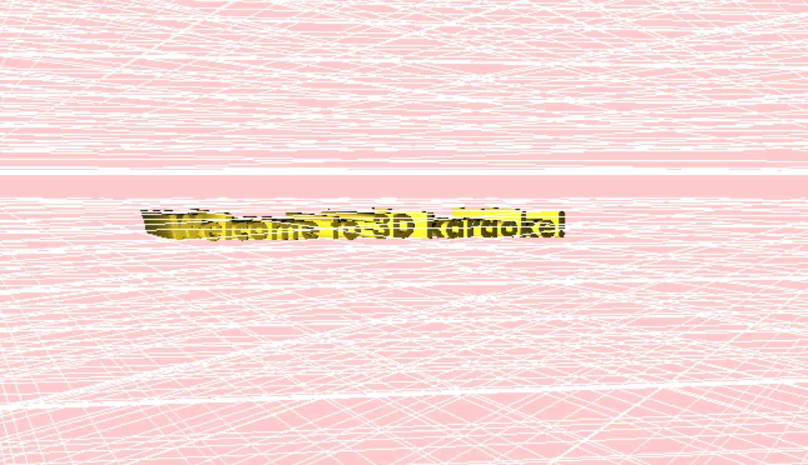

# 3D Karaoke

Welcome to 3D karaoke, a three-dimensional audio-visualizer built using
the Three.js library.

##Technology
The project makes extensive use of the Three.js library's standard functionality.
To render 3D representations of song lyrics to the screen, the app loads
a custom font and creates a geometry and mesh for each line the song. The lyrics update
as the song progresses.

Additionally, the app makes uses of the Three.js composer and its glitch pass to create temporally
random visual glitches.
